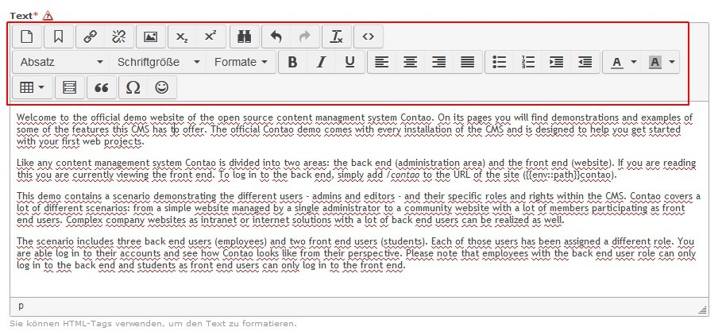

Contao Extension: TinyMceZUpClassic
===================================

Special TinyMCE setup which creates the toolbars known from TinyMCE 3.

For more information see [TinyMcePluginLoader](https://github.com/cliffparnitzky/TinyMcePluginLoader).

Installation
------------

Install the extension via composer: [cliffparnitzky/tiny-mce-setup-classic](https://packagist.org/packages/cliffparnitzky/tiny-mce-setup-classic).

If you prefer to install it manually, download the latest release here: https://github.com/cliffparnitzky/TinyMceZUpClassic/releases

Tracker
-------

https://github.com/cliffparnitzky/TinyMceZUpClassic/issues

Compatibility
-------------

- min. Contao version: >= 3.3.0
- max. Contao version: <  3.5.0

Dependency
----------

- All dependent plugins from [TinyMceBundleClassic](https://github.com/cliffparnitzky/TinyMceBundleClassic) have to be installed.

Screenshot
----------

